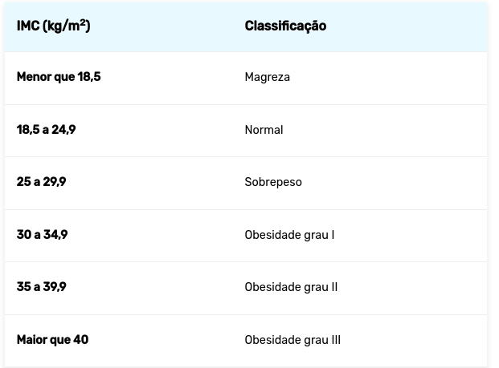

# Questões da recuperação de Linguagem/Internet

 1. Realizar um código em JavaScript para classificar o  IMC (Índice de Massa Corpórea), peso ideal de casa pessoa.

     * Para calcular IMC de acordo com a seguinte fórmula: <b>IMC = peso / (altura x altura).</b> 
     * Tabela de classificação do IMC
 
     * Exemplo parcial de exemplo
      ```js
      const peso = 95
      const altura = 1.80

      const imc = peso / (altura x altura)

      if(imc < 18.5) {
        console.log("Magreza")
      }else if(imc>= 18.5 && imc <=24.9){
        console.log("Normal)
      } 
      //precisa realizar demais condições para demais classificações
      ```
2. Realizar um código em JavaScript para exibir na saída do "console" números de 0 a 100 em ordem crescente.
   * Utilizar uma estrutura de repetição
   * Exemplo para resolução
    ```js 
    for(let i=0; i <=10; i++){
      console.log(i)
    }
    ```
3. Realizar um código em JavaScript para exibir na saída do "console" somente os números impar que se encontra entre 0 e 100
   * Utilizar uma estrutura de repetição
   * Para identificar se um número é impar pode ser realizado um divisão de inteiro por 2 caso o resultado seja diferente de zero o numero é impar
   * Carácter que representa divisão de inteiro em JavaScript <b>%</b>
   * Exemplo para resolução (Exibe somente números pares)
    ```js 
    
      for(let i=0; i<=10; i++){

        //estrutura condicional para verificar se número na divisão de inteiro é igual a zero, caso for este número é par       
       if(i%2 ===0){
          console.log(i)
        }
      }
    ```
4. Uma empresa quer verificar se um empregado está qualificado para a aposentadoria ou não. Para
estar em condições, <b>um dos</b> seguintes requisitos deve ser satisfeito:
   - Ter no mínimo 65 anos de idade.
   - Ter trabalhado no mínimo 30 anos.
   - Ter no mínimo 60 anos e ter trabalhado no mínimo 25 anos.
Com base nas informações acima, faça um código em JavaScript que com base no ano
de seu nascimento e o ano de seu ingresso na empresa. O programa deverá escrever a idade e o tempo
de trabalho do empregado e a mensagem 'Requerer aposentadoria' ou 'Não requerer'.
    - Exemplo para resolução
    ```js 
      const anoAtual = 2022
      const anoDeEntradaNaEmpresa = 2000
      const anoDeNascimento = 1989

      const idade = anoAtual - anoDeNascimento
      const tempoDeEmpresa = anoAtual - anoDeEntradaNaEmpresa

      console.log(`Idade: ${idade}`)
      console.log(`Tempo de trabalho: ${tempoDeEmpresa}`)


      if(idade > 65) {
        console.log(`Requerer aposentadoria`)
      }
      /*
        necessário adicionar outros demais condições referente a qualificação de aposentadoria,
        continue a partir daqui
      */
      else {
        console.log(`Não requerer`)
      }


    ```
